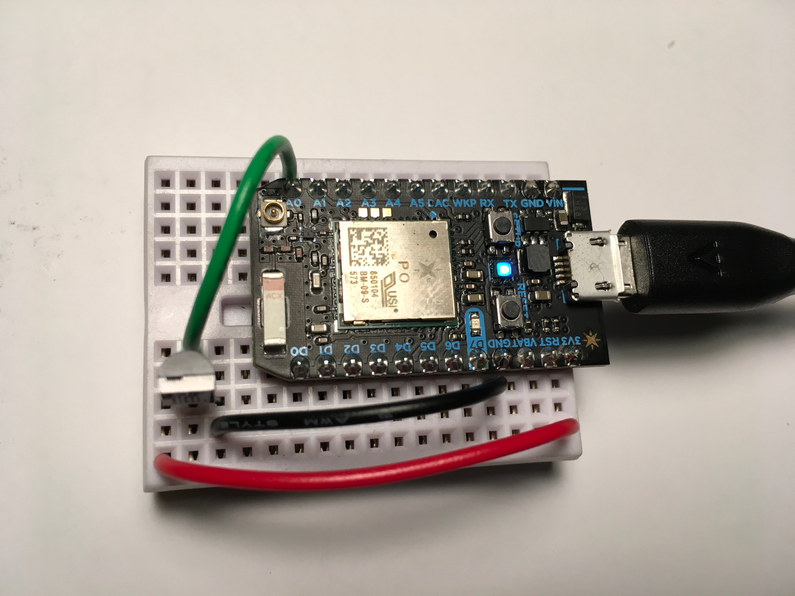

# temperature

## Setup



## Starter Code

*Adapted from an example in the [Particle docs](https://docs.particle.io/guide/getting-started/examples/photon/#read-your-photoresistor-function-and-variable)*

``` c_cpp
// -----------------------------------------
// Temperature
// -----------------------------------------

// In this example, we're going to register a Particle.variable() with the cloud so that we can read the level of a temperature sensor.

double temperature = A0; // This is the input pin where you read the value of the sensor.

double analogvalue; // Here we are declaring the integer variable analogvalue, which we will use later to store the value of the sensor.

void setup() {

    // This lets the device know which pin will be used to read incoming voltage.
    pinMode(temperature, INPUT);  // Our sensor pin is input (reading the sensor)

    // We are going to declare a Particle.variable() here so that we can access the value of the sensor from the cloud.
    Particle.variable("analogvalue", &analogvalue, DOUBLE);
    // This is saying that when we ask the cloud for "analogvalue", this will reference the variable analogvalue in this app, which is a double variable.

}

void loop() {

    // check to see what the value of the sensor is and store it in the int variable analogvalue
    analogvalue = (((analogRead(temperature) * 3.3)/4095) - 0.5) * 100; 
    delay(100);
    
}
```