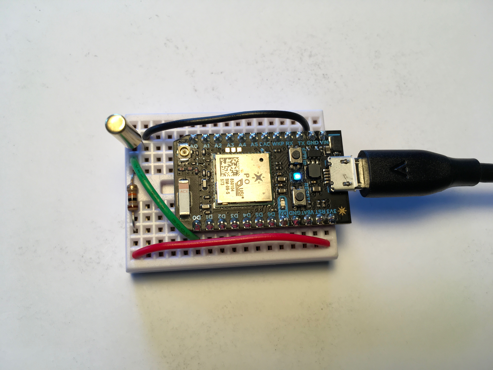

# tilt ball

## Setup



## Starter Code

*Adapted from an example in the [Particle docs](https://docs.particle.io/guide/getting-started/examples/photon/#read-your-photoresistor-function-and-variable)*

``` cpp
// -----------------------------------------
// Tilt sensor
// -----------------------------------------

// In this example, we're going to register a Particle.variable() with the cloud so that we can read the status of a ball tilt sensor.

int tilt = D0; // This is the input pin where you read the value of the sensor.

int analogvalue; // Here we are declaring the integer variable analogvalue, which we will use later to store the value of the sensor.

void setup() {

    // This lets the device know which pin will be used to read incoming voltage.
    pinMode(tilt,INPUT);  // Our sensor pin is input (reading the sensor)

    // We are going to declare a Particle.variable() here so that we can access the value of the sensor from the cloud.
    Particle.variable("analogvalue", &analogvalue, INT);
    // This is saying that when we ask the cloud for "analogvalue", this will reference the variable analogvalue in this app, which is an integer variable.

}

void loop() {

    if (digitalRead(tilt) == HIGH) {

        // =1 if tilted
        analogvalue = 1;
        delay(100);
        
    }
    
    else {

        // =0 if not tilted
        analogvalue = 0;
        delay(100);
        
    }
    
}
```

